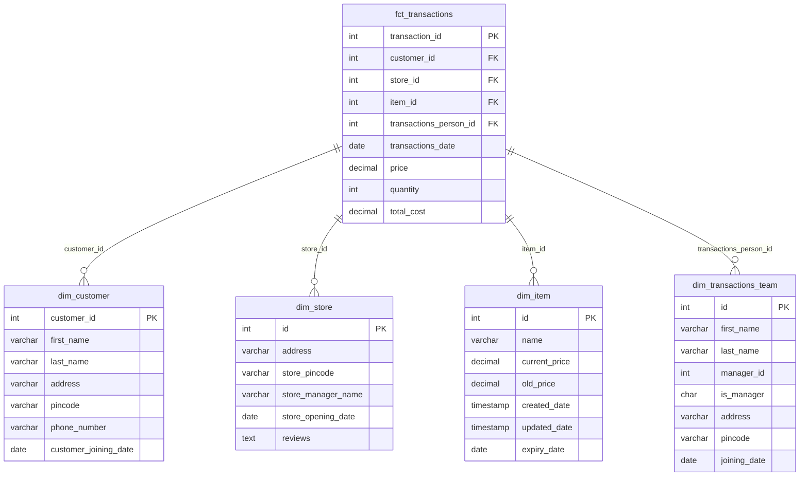

# Overview

This is a ETL Data Pipeline that downloads user transaction and profile data from aws s3 -> to local my sql database server -> 

It handles large volumes of data (~15GB/day), includes data encryption, logging, schema validation, AWS S3 integration using Boto3, and is designed with Spark fundamentals for transformation.

Although developed locally for demonstration purposes, this codebase is structured and production-ready. The project mimics daily professional tasks of a DE team, particularly managing transactional and customer sales data, transforming it, and loading it into data marts for further analytics.

spark , partitioning , parquet (columnar data ) to effieciently transfer and store 

Data validation , checking , extra column , data error , 
staging table to check for status and to monitor failure and dealing with it 
logging


# Tech Stack Used :
- Apache Spark
- Pyspark
- AWS S3
- SQL and dataframe operations

# Key Features :
- A fully end to end ETL data pipeline which closely mimics  to a production environment consisting of aws s3 , pyspark and local mysql database with relatively small dataset 
- usage of spark including connection to mysql db , dataframe creation , schema check , data handling for missing or additional data , partition and joining 
- use of aws s3 
- Implemented JDBC connections to external databases
- Designed efficient ETL workflow with optimized job execution
- Orchestrated multiple Spark jobs with FIFO scheduling
- Complete monitoring through Spark UI
- Successfully processed 81+ jobs with consistent performance
- Specific Data marts build for different use cases.
- Encryption of access keys and other important info.


# Project Directory Tree

```
.
├── directory_tree.txt
├── local_project_directory_download_location
│   ├── customer_data_mart
│   ├── error_files
│   ├── file_from_s3
│   ├── transactions_partition_data
│   └── transactions_team_data_mart
├── mysql_local_db_tables.png
├── random_generated_data
│   ├── sales_data.csv
│   └── transactions_data.csv
├── readme.md
├── resources
│   ├── dev
│   │   ├── config.py
│   │   └── requirements.txt
│   └── sql_scripts
│       └── table_scripts.sql
├── spark jobs screenshot.png
└── src
    ├── main
    │   ├── delete
    │   │   ├── aws_delete.py
    │   │   ├── database_delete.py
    │   │   └── local_file_delete.py
    │   ├── download
    │   │   └── download_from_s3.py
    │   ├── move
    │   │   └── move_files.py
    │   ├── read
    │   │   ├── database_read.py
    │   │   └── read_from_s3.py
    │   ├── transformations
    │   │   └── jobs
    │   │       ├── customer_mart_sql_tranform_write.py
    │   │       ├── dimension_tables_join.py
    │   │       ├── main.py
    │   │       └── transactions_mart_sql_transform_write.py
    │   ├── upload
    │   │   └── upload_to_s3.py
    │   ├── utility
    │   │   ├── encrypt_decrypt.py
    │   │   ├── logging_config.py
    │   │   ├── mysql_session.py
    │   │   ├── s3_client_object.py
    │   │   └── spark_session.py
    │   └── write
    │       ├── database_write.py
    │       └── dataframe_writer.py
    └── test
        ├── generate_csv_data.py
        ├── generate_customer_table_data.py
        └── transactions_data_upload_s3.py

```
# Spark Job Final Image


# Project Architecture and Data flow 


```

[Transaction data is generated at point-of-sale systems ( used random Sample Data here) ] 
                  ↓
[Download from aws S3 bucket via boto3 client] 
                  ↓
[to Local Directory after data validation ]
                  ↓
[creation of spark session with connecting to mysql local db ]
                  ↓
[data check with Spark and handling correct and error files ]
                  ↓
[Staging table status update in mysql local database of this ETL process ]
                  ↓
[Creating spark dataframe with handling of additional columns]
                  ↓
[loading dimension table from mysql local db via spark jdbc driver and creating dataframes ]
                  ↓
[MySQL DB] ↔ [Fact & Dim Tables Join]
                  ↓
[Selecting colunms for datamarts and Ingesting parquet files into local and S3]
                  ↓
[Selecting colunms for datamarts and Ingesting parquet files into local and S3]
                  ↓                 
[Writing Transaction data in partition via pyspark and loading into local and S3 in Parquet Format (Partitioned by Month & Store details better optimizing in further read/scan for downstream analytics)]
                  ↓
[Deleting local files as not needed after uploading on s3 ]
                  ↓
[Update status in staging tables in local my sql db for all the files]
                  ↓
[S3 (Final Data Mart Upload)]

```

# Database ER Diagram
1 fact table and 4 dimension table 
The fact table will have Customer transactional actual data and will be accessing this data daily/monthly from aws s3
Dimension table gives context and info about customer , store , item , transaction_person


```
Star Schema


          +-------------------+
          |   Customer_Dim    |
          +-------------------+
          | customer_id (PK)  |
          | name              |
          | address           |
          | phone_number      |
          | join_date         |
          +-------------------+
                    |
                    |
                    v
          +-------------------+
          |    Fact_Table     |
          +-------------------+
          | customer_id (FK)  |
          | store_id (FK)     |
          | product_id (FK)   |
          | billing_id (FK) 
         |
          | sales_date        |
          | price             |
          +-------------------+
         /     |        |        \
        v      v        v         v
+------------+ +------------+ +--------------+ +--------------------+
| Store_Dim  | | item_Dim   | | Billing_Dim  | |transactionsteam_Dim|
+------------+ +------------+ +--------------+ +--------------------+
| store_id   | | item_id    | | billing_id   | | transaction_team_id|
| address    | | name, info | |   item       | | total_monthly_spend |
| reviews    | |currentprice| |  customer_id | |
| manager    | | oldprice   | |   mgr        | | address    |
+------------+ +------------+ +--------------+ +--------------------+

```

# Star Schema Database Design

This repository contains a star schema database design with one fact table and four dimension tables for a retail transaction system.

## Database Schema



# Local mysql db table description of staging tables and data marts:
https://github.com/prashant-newway/Etl-data-pipeline-pyspark-aws/blob/main/mysql_local_db_tables.png?raw=true
# Data checks 
- logging 
- error handling
- file path , file name , 
- correct schema check and then process for both missing or extra column
- extra column handling
- wrong files handling 
- missing columns check 

#  Known Limitations and potential To Do 

- orchestration either creating dags via airflow or aws eventbridge and lambda can be used 
- more dynamic code
- more file structure rather than just csv 
- data encryption especially personal data 
- deletion of files after a certain period to have a backup incase of failure while uploading on s3
